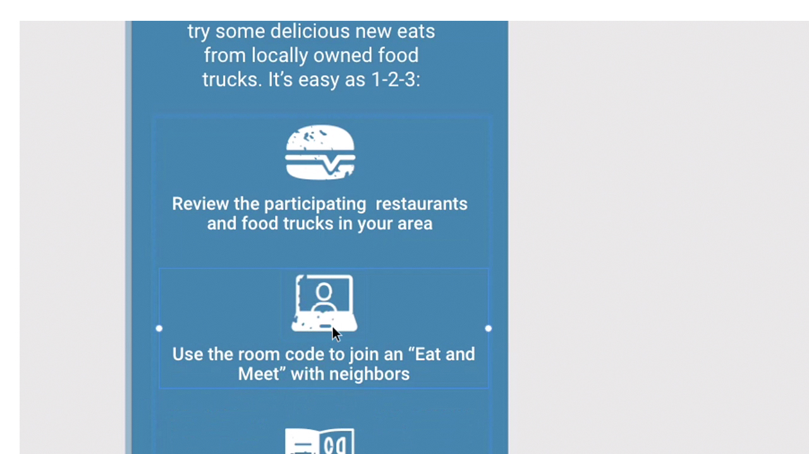

# XD

Adobe XD est un outil de conception et de prototypage d’expérience utilisateur permettant de concevoir des sites web, des applications, des interfaces vocales, des jeux et d’autres types d’expériences numériques.

## Parcourir les Tutorials de produit

<table style="table-layout:fixed">
<tr>
 <td>
   
    

   <a href="xd.md#tutorial1"><strong>Créer des composants avec des états de survol</strong></a>
    

    <em>Créez des boutons réutilisables et redimensionnables dynamiquement pour vos conceptions interactives</em>
     
  </td>
  <td>
    
    

    <a href="xd.md#tutorial2"><strong>Créer et remplir une grille de répétition</strong></a>
    

    <em>Transformez un élément unique en grilles répétitives d'un simple clic</em>
     
  </td>
  <td>
   
    

    <a href="xd.md#tutorial3"><strong>Utilisation des piles</strong></a>
    

    <em>Utilisez la propriété stack pour réorganiser facilement les éléments</em>
     
  </td>
</tr>
<tr>
 <td>
    
    

    <a href="xd.md#tutorial4"><strong>Créer un prototype : liens d’ancrage et 
Groupes défilants</strong></a>
    

    <em>Ajouter la navigation et le défilement à un prototype</em>
     
  </td>
  <td>
    
    

    <a href="xd.md#tutorial5"><strong>Créer un prototype : états de composant interactif</strong></a>
    

    <em>Ajouter de l'interactivité et un menu d'incrustation à un prototype</em>
     
  </td>
  <td>
   
    

   <a href="xd.md#tutorial7"><strong>E-mail : création et remplissage d'une grille de répétition</strong></a>
    

    <em>Transformez un élément unique en grilles répétitives d'un simple clic</em>
     
  </td>
</tr>
<tr>
 <td>
    
    

    <a href="xd.md#tutorial7"><strong>E-mail - Utilisation des piles</strong></a>
    

    <em>Utilisez la propriété stack pour réorganiser facilement les éléments</em>
     
  </td>
  <td>
    
    

     
  </td>
  <td>
    
    

     
  </td>
</tr>
</table>

## Créer des [!UICONTROL composants] avec des états de survol (7:35) {#tutorial1}

>[!VIDEO](https://video.tv.adobe.com/v/326874?hidetitle=true)

**Description**
Créez des boutons réutilisables et redimensionnables dynamiquement pour vos conceptions interactives.

Dans ce tutoriel, vous apprendrez à :
* Apportez des modifications à un composant principal source et ces modifications sont automatiquement transmises à toutes les instances de ce composant
* Utilisez des composants pour plus de cohérence, gagner du temps et éviter les clics

**Présenté par :**
Michael Murphy, conseiller principal en solutions (médias numériques)

## Créer et remplir une grille de répétition (2:57) {#tutorial2}

>[!VIDEO](https://video.tv.adobe.com/v/326955?hidetitle=true)

**Description**
Transformez un élément unique en grilles répétées d’un simple clic et glisser-déposer.

Dans ce tutoriel, vous apprendrez à :
* Dynamisez votre workflow et faites glisser instantanément toute grille dimensionnée dont vous avez besoin
* Importez du contenu et des données réels et XD placera comme par magie toutes les images et le texte sur votre grille
* Apportez les modifications une seule fois et appliquez-les où vous le souhaitez, dans n’importe quelle direction

**Présenté par :**
Ashley Dvorin, conseillère principale en solutions (médias numériques)

## Utilisation des piles (5:33) {#tutorial3}

>[!VIDEO](https://video.tv.adobe.com/v/326956?hidetitle=true)

**Description**
Utilisez la propriété stack pour réorganiser facilement les éléments.

Dans ce tutoriel, vous apprendrez à :
* Maintenez l’alignement et l’espacement entre les objets de votre zone de travail même lorsque votre conception change
* Insérez de nouveaux objets ou réorganisez les objets dans une pile et tout s’ajuste automatiquement

**Présenté par :**
Michael Murphy, conseiller principal en solutions (médias numériques)

## Créer un prototype : liens d’ancrage et groupes de défilement (9:55) {#tutorial4}

>[!VIDEO](https://video.tv.adobe.com/v/326957?hidetitle=true)

**Description**
Ajoutez la navigation et le défilement à un prototype.

Dans ce tutoriel, vous apprendrez à :
* Ajoutez des liens vers vos prototypes grâce à une action qui permet aux utilisateurs de sauter à différents points d’un même plan de travail
* Créez des flux d’activités, des carrousels d’images, des listes de produits et plus encore en définissant des zones qui défilent indépendamment du reste de vos conceptions
* Créer des groupes qui défilent verticalement, horizontalement ou les deux

**Présenté par :**
Michael Murphy, conseiller principal en solutions (médias numériques)

## Créer un prototype - États de composant interactif (8:55) {#tutorial5}

>[!VIDEO](https://video.tv.adobe.com/v/326958?hidetitle=true)

**Description**
Ajoutez de l’interactivité et un menu d’incrustation à un prototype.

Dans ce tutoriel, vous apprendrez à :
* Créez une expérience utilisateur interactive et animée non linéaire sans avoir besoin de plans de travail supplémentaires
* Créer plusieurs flux de prototypes ou d’interactions dans un seul document XD et publier des liens partageables uniques pour chaque flux

**Présenté par :**
Emilie Enke, conseillère en solutions associées (médias numériques)

## E-mail : créer et remplir une grille de répétition (4:45) {#tutorial6}

>[!VIDEO](https://video.tv.adobe.com/v/326775?hidetitle=true)

**Description**
Transformez un élément unique en grilles répétées d’un simple clic et glisser-déposer.

Dans ce tutoriel, vous apprendrez à :
* Dynamisez votre workflow et faites glisser instantanément toute grille dimensionnée dont vous avez besoin
* Importez du contenu et des données réels et XD placera comme par magie toutes les images et le texte sur votre grille
* Apportez les modifications une seule fois et appliquez-les où vous le souhaitez, dans n’importe quelle direction

**Présenté par :**
Victoria Torres, conseillère en solutions (médias numériques)

## E-mail - Utilisation des piles (3:38) {#tutorial7}

>[!VIDEO](https://video.tv.adobe.com/v/326759?hidetitle=true)

**Description**
Utilisez la propriété stack pour réorganiser facilement les éléments.

Dans ce tutoriel, vous apprendrez à :
* Maintenez l’alignement et l’espacement entre les objets de votre zone de travail même lorsque votre conception change
* Insérez de nouveaux objets ou réorganisez les objets dans une pile et tout s’ajuste automatiquement

**Présenté par :**
Victoria Torres, conseillère en solutions (médias numériques)

Logo 

**Ressources XD**

[Formation et assistance](https://helpx.adobe.com/support/xd.html) est votre point central pour consulter d&#39;autres tutoriels, les [Nouveautés](https://helpx.adobe.com/xd/user-guide.html/xd/help/whats-new.ug.html) et des liens vers les forums de la communauté.

**Version D&#39;Octobre 2020**

Commencez à utiliser ces fonctionnalités (et bien plus encore !) en téléchargeant la dernière mise à jour depuis l’application de bureau Creative Cloud.
