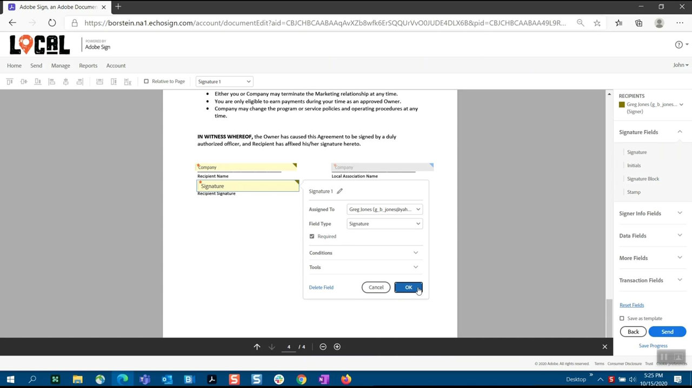

# Acrobat &amp; Sign

Grâce à Adobe Document Cloud, qui intègre les meilleures solutions de signature électronique et de PDF au monde, vous pouvez transformer des processus de documents manuels en processus numériques efficaces. Votre équipe peut désormais agir rapidement sur des documents, des flux de travaux et des tâches — sur plusieurs écrans et appareils — où que vous soyez, à tout moment et dans vos applications Microsoft et d’entreprise préférées.

## Parcourir les Tutorials de produit

<table style="table-layout:fixed">
<tr>
 <td>
   
    

   <a href="acrobat-sign.md#tutorial1"><strong>Lancement d'une révision partagée Acrobat</strong></a>
    

    <em>Inviter les réviseurs à ajouter leurs commentaires à un document PDF</em>
     
  </td>
  <td>
    
    

    <a href="acrobat-sign.md#tutorial2"><strong>Créer un Forms d'exemption en ligne avec Adobe Sign</strong></a>
    

    <em>Transformez rapidement des documents en formulaires en ligne et publiez-les en ligne où quiconque en a besoin peut les remplir et les signer.</em>
     
  </td>
  <td>
   
    

    <a href="acrobat-sign.md#tutorial3"><strong>Demander une signature avec Adobe Sign</strong></a>
    

    <em>Passer de Word au PDF et envoyer pour signature avec Adobe Sign</em>
     
  </td>
</tr>
<tr>
 <td>
   
    

   <a href="acrobat-sign.md#tutorial4"><strong>Affichage des menus sur mobile en mode liquide</strong></a>
    

    <em>Utilisation du mode liquide pour améliorer l’expérience de lecture des fichiers PDF sur les appareils mobiles</em>
     
  </td>
  <td>
    
    

    <a href="acrobat-sign.md#tutorial5"><strong>Numérisation de documents au format PDF depuis votre téléphone mobile</strong></a>
    

    <em>Avec Adobe Scan, capturez et convertissez facilement des documents, des formulaires, des cartes de visite et des tableaux blancs en fichiers PDF Adobes de qualité supérieure.</em>
     
  </td>
  <td>
    
    

     
  </td>
</tr>
</table>

## Lancement d&#39;une révision partagée Acrobat (3:49) {#tutorial1}

>[!VIDEO](https://video.tv.adobe.com/v/326777?hidetitle=true)

****
DescriptionInvitez les réviseurs à ajouter leurs commentaires à un document PDF.

Dans ce tutoriel, vous apprendrez à :
* Commentaires de fichiers PDF hôtes dans le Document Cloud
* Rassemblement des commentaires à un endroit
* Les commentaires simultanés encouragent la collaboration

**Comparaison des options de révision et de commentaire des Adobes PDF**

**Présenté par :**
Dan Armstrong, Consultant en solutions (Digital Media) Rick Borstein, Responsable senior Solution Consulting (Digital Media)

## Create Online Waiver Forms with Adobe Sign (5:19, disponible en anglais uniquement) {#tutorial2}

>[!VIDEO](https://video.tv.adobe.com/v/326776?hidetitle=true)

****
DescriptionTransformez rapidement des documents en formulaires en ligne et publiez-les en ligne où quiconque en a besoin peut les remplir et les signer.

Dans ce tutoriel, vous apprendrez à :
* Numérique en transformant des formulaires papier en documents numériques
* Publication de formulaires numériques sur votre site web où les clients peuvent y accéder depuis leur propre appareil
* Les formulaires remplis sont automatiquement archivés pour vos enregistrements.

**Présenté par :**
Taylor Kobey, Consultant en solutions (Digital Media) Emily Palmer, Consultant en solutions (Digital Media)

## Demander une signature avec Adobe Sign (3:21) {#tutorial3}

>[!VIDEO](https://video.tv.adobe.com/v/326801?hidetitle=true)

****
DescriptionPassez de Word au PDF et envoyez pour signature avec Adobe Sign.

Dans ce tutoriel, vous apprendrez à :
* Utilisation des outils que vous utilisez quotidiennement pour envoyer des documents numériques pour signature

**Présenté par :**
Rick Borstein, Responsable senior Solution Consulting (Digital Media)

## Affichage des menus sur mobile en mode liquide (2:57) {#tutorial4}

>[!VIDEO](https://video.tv.adobe.com/v/327093?hidetitle=true)

****
DescriptionUtilisez le mode Liquide pour améliorer l’expérience de lecture des fichiers PDF sur les appareils mobiles.

Dans ce tutoriel, vous apprendrez à :
* Rendre les fichiers PDF réactifs pour les appareils mobiles
* Amélioration de la mise en page PDF
* Ajoutez des fonctionnalités à la volée pour vous aider à lire facilement des documents sur votre téléphone et votre tablette.

**Présenté par :**
Emilie Enke, conseillère en solutions associée (Digital Media)

## Numérisation de documents au format PDF depuis votre téléphone portable (5:53) {#tutorial5}

>[!VIDEO](https://video.tv.adobe.com/v/327094?hidetitle=true)

****
DescriptionAvec Adobe Scan, capturez et convertissez facilement des documents, des formulaires, des cartes de visite et des tableaux blancs en fichiers PDF Adobes de qualité supérieure.

Dans ce tutoriel, vous apprendrez à :
* Utilisez votre téléphone mobile pour capturer et convertir des documents, des formulaires, des cartes de visite et des tableaux blancs en fichiers PDF Adobes de haute qualité.
* Identification et netteté automatiques du texte écrit ou imprimé à la main, tout en supprimant les éléments indésirables, tels que les reflets et les ombres
* Ouvrez le fichier PDF numérisé dans Acrobat Reader pour y ajouter des notes et des commentaires, puis passez en revue avec votre équipe.

**Présenté par :**
Emilie Enke, conseillère en solutions associée (Digital Media)

**Ressources Acrobat et Adobe Sign**

[Découvrez et ](https://helpx.adobe.com/support/document-cloud.html) aidez votre hub pour des tutoriels supplémentaires, des  [nouveautés](https://helpx.adobe.com/acrobat/using/whats-new.html) et des liens vers des forums communautaires.

**Version d’octobre 2020**

Commencez à utiliser ces fonctionnalités (et bien plus encore). en téléchargeant la dernière mise à jour depuis votre application pour postes de travail Creative Cloud.
