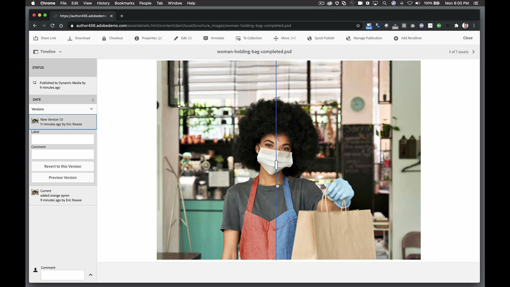

# AEM Assets et Asset Link

Adobe Experience Manager est la solution de gestion de l’expérience digitale de référence pour les entreprises et les moyennes structures. Il offre une base moderne et évolutive pour déployer des expériences attrayantes qui favorisent les interactions avec la marque, suscitent la demande et fidélisent davantage les clients. Experience Manager inclut un ensemble complet d&#39;outils pour créer, gérer et diffuser des expériences digitales sur tous les canaux.

## Parcourir les Tutorials de produits

<table style="table-layout:fixed">
<tr>
 <td>
   
    

   <a href="aem.md#tutorial1"><strong>AEM et Asset Link</strong></a>
    

    <em>Effectuez des mises à jour en temps réel des actifs stockés dans AEM avec Asset Link</em>
     
  </td>
   <td>
   
    

   <a href="aem.md#tutorial2"><strong>Fichiers InDesign hébergés dans AEM</strong></a>
    

    <em>Hébergez votre document InDesign dans AEM afin que plusieurs utilisateurs puissent créer simultanément des variantes de contenu</em>
     
  </td>
  <td>
    
    

     
  </td>
</tr>
</table>

## AEM et Asset Link (5:45) {#tutorial1}

>[!VIDEO](https://video.tv.adobe.com/v/326828?hidetitle=true)

**Description**
Mettez à jour les assets stockés dans AEM en temps réel avec Asset Link.

Dans ce tutoriel, vous apprendrez à :
* Trouvez ce dont vous avez besoin, quand vous en avez besoin, grâce à un panneau dédié permettant de rechercher et de parcourir les ressources au sein de vos programmes de conception
* Transférez facilement des ressources directement depuis vos applications de design
* Extrayez et archivez des assets depuis le système DAM dans votre programme de design pour effectuer des mises à jour en temps réel

**Présenté par :**
Eric Rowse, consultant senior en solutions (médias numériques)

## Fichiers d&#39;InDesign hébergés dans AEM (3:16) {#tutorial2}

>[!VIDEO](https://video.tv.adobe.com/v/326829?hidetitle=true)

**Description**
Hébergez votre document InDesign dans AEM afin que plusieurs utilisateurs puissent créer simultanément des variantes de contenu.

Dans ce tutoriel, vous apprendrez à :
* Télécharger le fichier d’InDesign dans AEM pour un accès commun au stockage
* Créez des variantes en toute sécurité sans craindre d’endommager le fichier source
* Les champs de document sont préformatés, ce qui permet de modifier rapidement le contenu

**Présenté par :**
Eric Rowse, consultant senior en solutions (médias numériques)

<table style="table-layout:fixed">
<tr>
 <td>
   
    

   <a href="https://www.adobe.com/marketing/experience-manager.html"><strong>Adobe Experience Manager</strong></a>
    

    <em>Une puissante solution pour vos besoins en matière de gestion de contenu et d’assets digitaux</em>
     
  </td>
  <td>
   
    

   <a href="https://www.adobe.com/marketing/experience-manager-assets.html"><strong>AEM Assets</strong></a>
    

    <em>Gestion des assets digitaux de nouvelle génération</em>
     
  </td>
  <td>
   
    

   <a href="https://www.adobe.com/marketing/experience-manager-assets/benefits.html"><strong>AEM Assets : Avantages</strong></a>
    

    <em>Tirez parti de vos assets digitaux</em>
     
  </td>
</tr>
</table>

**Ressources Asset Link et AEM**

[Formation et support](https://helpx.adobe.com/support/experience-manager.html) est votre centre d’informations sur les nouveautés et les tutoriels supplémentaires, ainsi que des liens vers les forums de la communauté.

**Version d’octobre 2020**

Commencez à utiliser ces fonctionnalités (et bien plus encore !) en téléchargeant la dernière mise à jour depuis l’application pour postes de travail de votre Creative Cloud.
