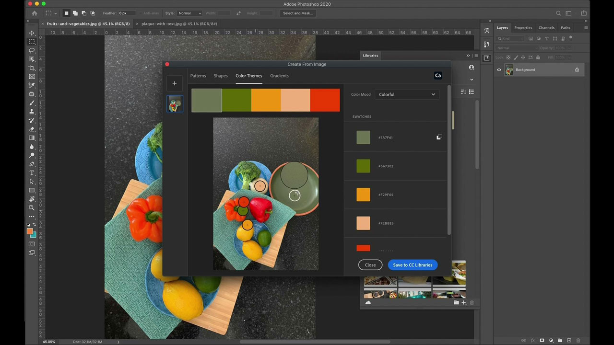

# [!DNL Capture]

L&#39;Adobe [!DNL Capture] transforme les téléphones mobiles et les tablettes en un outil de collection de design. Les utilisateurs peuvent créer de nombreux types d’actifs différents (éléments numériques individuels pour les illustrations).   Ces actifs sont automatiquement synchronisés avec d’autres applications d’Adobe pour postes de travail et terminaux mobiles. Les utilisateurs peuvent les importer dans leurs projets de création ou les partager facilement avec des collaborateurs.

## Parcourir les Tutorials de produit

<table style="table-layout:fixed">
<tr>
 <td>
   
    

   <a href="capture.md#tutorial1"><strong>Capturer l'inspiration du monde qui vous entoure</strong></a>
    

    <em>Utilisez les puissants outils de sélection et de modification des couleurs de la capture d’Adobe pour modifier radicalement une image en fonction des besoins de votre marque d’entreprise.</em>
     
  </td>
  <td>
    
    

     
  </td>
  <td>
    
    

     
  </td>
</tr>
</table>

## Capturer l&#39;inspiration du monde qui vous entoure (2:56) {#tutorial1}

>[!VIDEO](https://video.tv.adobe.com/v/326825?hidetitle=true)

****
DescriptionTransformez des images et des vidéos sur votre appareil mobile en éléments de création pour toutes vos créations.

Dans ce tutoriel, vous apprendrez à :
* Design Anywhere
* Intégration d’applications pour postes de travail via les bibliothèques CC
* Accès à des milliers d&#39;Adobe Fonts

**Présenté par :**
Emily Palmer, conseillère en solutions (Digital Media)

**[!DNL Capture]Ressources**

[Découvrez et ](https://helpx.adobe.com/mobile-apps/help/capture-faq.html) aidez votre hub pour consulter des tutoriels supplémentaires et des liens vers des forums communautaires.

**Version d’octobre 2020**

Commencez à utiliser ces fonctionnalités (et bien plus encore). en téléchargeant la dernière mise à jour depuis votre application pour postes de travail Creative Cloud.
