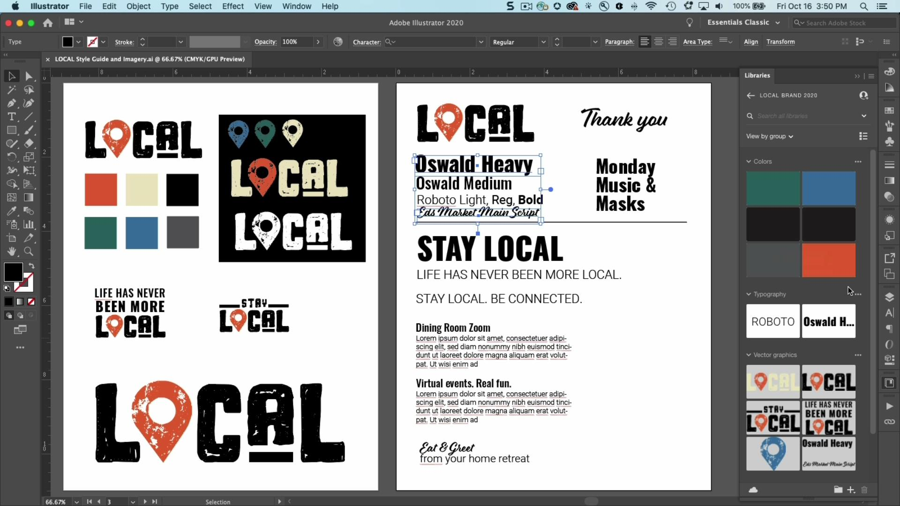

# Bibliothèques CC

Gardez vos actifs à portée de main et vos projets sur la marque.

## Parcourir les Tutorials de produit

<table style="table-layout:fixed">
<tr>
 <td>
   
    

   <a href="cclibraries.md#tutorial1"><strong>Création de bibliothèques CC</strong></a>
    

    <em>Grâce aux bibliothèques Adobe Creative Cloud, vous pouvez gérer, organiser et accéder à vos logos, couleurs, etc. dans vos applications Creative Cloud préférées.</em>
     
  </td>
   <td>
   
    

   <a href="cclibraries.md#tutorial2"><strong>Partage de bibliothèques CC</strong></a>
    

    <em>Gagnez en efficacité, garantissez la cohérence créative et restez en parfaite synchronisation avec votre équipe</em>
     
  </td>
  <td>
    
    

     
  </td>
</tr>
</table>

## Création de bibliothèques CC (4:38) {#tutorial1}

>[!VIDEO](https://video.tv.adobe.com/v/326802?hidetitle=true)

****
DescriptionGrâce aux bibliothèques Adobe Creative Cloud, vous pouvez gérer, organiser et accéder à vos logos, couleurs, etc. dans vos applications Creative Cloud préférées.

Dans ce tutoriel, vous apprendrez à :
* Conserver vos ressources à portée de main et vos projets en toute marque
* Nouveau! Intégration complète avec Adobe XD

**Présenté par :**
Ashley Dvorin, conseillère principale en solutions (médias numériques)

## Partage de bibliothèques CC (4:14) {#tutorial2}

>[!VIDEO](https://video.tv.adobe.com/v/326803?hidetitle=true)

****
DescriptionTravaillez plus efficacement, assurez la cohérence créative et restez facilement synchronisé avec votre équipe.

Dans ce tutoriel, vous apprendrez à :
* Conserver vos ressources à portée de main et vos projets en toute marque
* Collaborez facilement sur des projets directement depuis vos applications préférées

**Présenté par :**
Ashley Dvorin, conseillère principale en solutions (médias numériques)

**Ressources des bibliothèques CC**

[Découvrez et ](https://helpx.adobe.com/creative-cloud/help/libraries.html) aidez votre hub pour des tutoriels supplémentaires, des nouveautés et des liens vers des forums communautaires.

**Version d’octobre 2020**

Commencez à utiliser ces fonctionnalités (et bien plus encore). en téléchargeant la dernière mise à jour depuis votre application pour postes de travail Creative Cloud.
