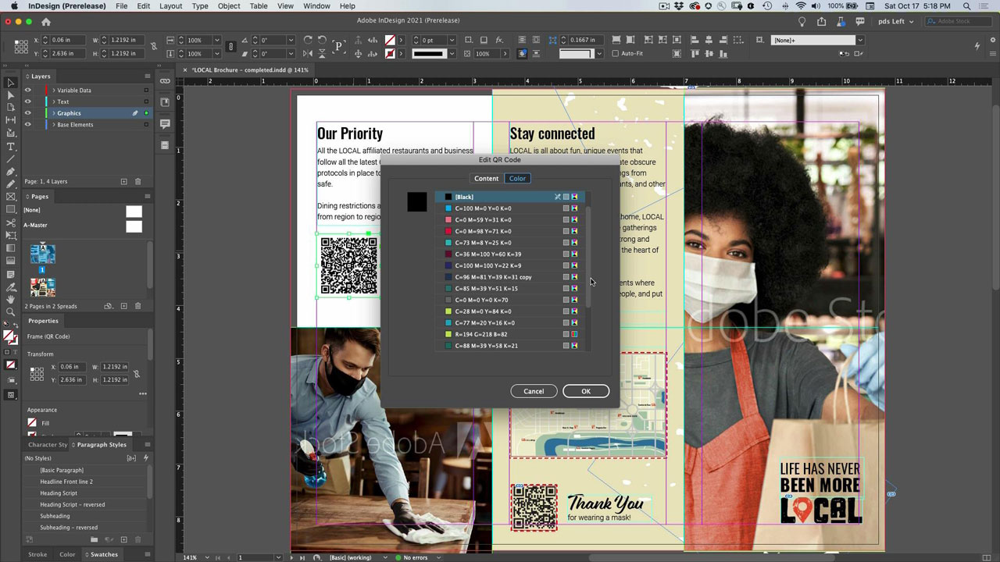

# InDesign

L’application de référence pour créer de superbes documents pour l’impression et la publication numérique. Créez de riches expériences numériques et imprimées, des livres électroniques aux livres, rapports et livres blancs.

## Parcourir les Tutorials de produit

<table style="table-layout:fixed">
<tr>
 <td>
    
    

    <a href="indesign.md#tutorial1"><strong>Générer des codes QR</strong></a>
    

    <em>Génération d’un code QR lié à un site Web</em>
     
  </td>
  <td>
   
    

   <a href="indesign.md#tutorial2"><strong>Partager pour révision depuis l’InDesign</strong></a>
    

    <em>Une expérience de révision créative transparente pour les designers et les membres de leur équipe</em>
     
  </td>
  <td>
    
    

    <a href="indesign.md#tutorial3"><strong>Importer des commentaires PDF à partir d’une révision par Document Cloud</strong></a>
    

    <em>Importer des commentaires d’un fichier PDF directement dans l’InDesign et appliquer rapidement les modifications demandées</em>
     
  </td>
</tr>
<tr>
<td>
   
    

   <a href="indesign.md#tutorial4"><strong>Ajouter un fichier vidéo au document d’InDesign</strong></a>
    

    <em>Ajouter une vidéo à l’InDesign. Sortie au format PDF et publication en ligne</em>
     
  </td>
 <td>
    
    

     
 </td>
 <td>
    
    

     
 </td>
</tr>
</table>

## Génération de codes QR (2:34) {#tutorial1}

>[!VIDEO](https://video.tv.adobe.com/v/326818?hidetitle=true)

****
DescriptionGénérer un code QR qui lie à un site Web.

Dans ce tutoriel, vous apprendrez comment :
* Accès libre au contenu web via les appareils mobiles
* Assurer la sécurité de vos clients
* Le numérique facilite la mise à jour du contenu

**Présenté par :**
Patti Sokol, consultant principal en solutions (Digital Media)

## Partager pour révision à partir de l’InDesign (4:04) {#tutorial2}

>[!VIDEO](https://video.tv.adobe.com/v/326824?hidetitle=true)

****
DescriptionInDesign Share for Review offre une expérience de révision créative encore plus fluide aux designers et aux membres de leur équipe.

Dans ce tutoriel, vous apprendrez à :
* Lancement d’une révision directement à partir d’un InDesign sans avoir à créer de PDF
* Révision et commentaire à partir d’un navigateur web
* Collecte des commentaires de plusieurs parties prenantes au même endroit
* Gérez les commentaires dans l’application où des modifications peuvent être apportées immédiatement.

**Comparaison des options de révision et de commentaire des Adobes PDF**

**Présenté par :**
Emily Palmer, conseillère en solutions (Digital Media)

## Importation de commentaires PDF à partir d&#39;une révision par Document Cloud (4:52) {#tutorial3}

>[!VIDEO](https://video.tv.adobe.com/v/326959?hidetitle=true)

****
DescriptionImportez des commentaires d’un fichier PDF directement dans l’InDesign et appliquez rapidement les modifications demandées.

Dans ce tutoriel, vous apprendrez à :
* Prise en charge des workflows de commentaires PDF existants
* Fonctionne pour les fichiers PDF combinés à partir de plusieurs sources

**Comparaison des options de révision et de commentaire des Adobes PDF**

**Présenté par :**
Michael Murphy, conseiller principal en solutions (Digital Media)

## Ajout d&#39;un fichier vidéo au document d&#39;InDesign (5:58) {#tutorial4}

>[!VIDEO](https://video.tv.adobe.com/v/326757?hidetitle=true)

****
DescriptionAjoutez de la vidéo à l&#39;InDesign. Sortie au format PDF et publication en ligne.

Dans ce tutoriel, vous apprendrez à :
* Ajout d&#39;une vidéo à l&#39;InDesign
* Sortie au format PDF et publication en ligne

**Présenté par :**
Patti Sokol, consultant principal en solutions (Digital Media)

**Ressources InDesign**

[Découvrez et ](https://helpx.adobe.com/support/indesign.html) aidez votre hub pour des tutoriels supplémentaires, des  [nouveautés](https://helpx.adobe.com/indesign/user-guide.html/indesign/using/whats-new.ug.html) et des liens vers des forums communautaires.

**Version d’octobre 2020**

Commencez à utiliser ces fonctionnalités (et bien plus encore). en téléchargeant la dernière mise à jour depuis votre application pour postes de travail Creative Cloud.
