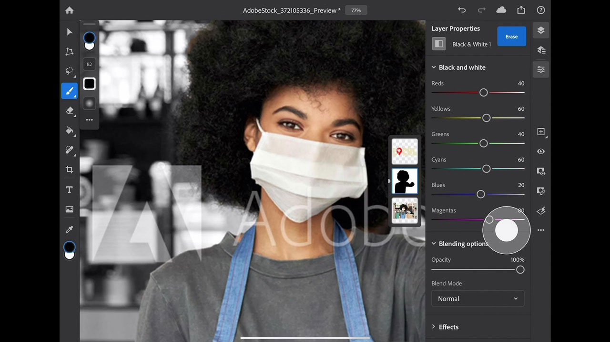

# Photoshop sur iPad

Photoshop est le meilleur logiciel de création d’images et d’illustrations au monde, permettant une créativité illimitée pour les professionnels sur tous les appareils. Chacun peut créer tout ce qu&#39;il imagine, où que l&#39;inspiration frappe. Si vous pouvez le penser, vous pouvez y arriver avec Photoshop.

## Parcourir les Tutorials de produit

<table style="table-layout:fixed">
<tr>
 <td>
   
    

   <a href="photoshopipad.md#tutorial1"><strong>Introduction à Photoshop sur l'iPad</strong></a>
    

    <em>Suivez une visite guidée de l'interface et découvrez quelques fonctionnalités de Photoshop repensées pour une utilisation sur l'iPad d'Apple.</em>
     
  </td>
  <td>
    
    

     
  </td>
  <td>
    
    

     
  </td>
</tr>
</table>

## Introduction à Photoshop sur l&#39;iPad (5:14) {#tutorial1}

>[!VIDEO](https://video.tv.adobe.com/v/326899?hidetitle=true)

****
DescriptionSuivez une visite guidée de l&#39;interface et découvrez quelques fonctionnalités de Photoshop repensées pour une utilisation sur l&#39;iPad d&#39;Apple.

Dans ce tutoriel, vous apprendrez à :
* Accédez à vos outils Photoshop préférés sur la
* Montage précis sur mobile sans nuire à la qualité
* Expérience plus immersive et naturelle
* Workflow fluide avec les documents en ligne

**Présenté par :**
Dan Armstrong, Consultant en solutions (Digital Media)

**Photoshop sur les ressources de l’iPad**

[Découvrez et ](https://helpx.adobe.com/support/photoshop.html) aidez votre hub pour consulter des tutoriels supplémentaires et des liens vers des forums communautaires.

**Version d’octobre 2020**

Commencez à utiliser ces fonctionnalités (et bien plus encore). en téléchargeant la dernière mise à jour depuis votre application pour postes de travail Creative Cloud.
