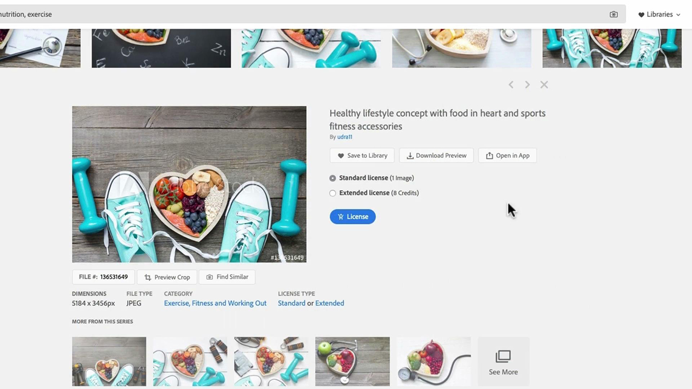

# Adobe [!DNL Stock] tutoriels

!

Les créatifs sont mis sous pression pour diffuser rapidement un nouveau contenu visuellement attrayant qui capte et retient l’attention. Adobe [!DNL Stock] L’abonnement Entreprise permet aux équipes de création d’accéder à plus de 200 millions d’images, de vidéos, de templates, d’illustrations, de fichiers audio et de ressources 3D, le tout depuis les applications de création Adobe qu’elles utilisent au quotidien.

## Cliquer pour afficher un Adobe [!DNL Stock] tutoriel

<table>
<tr>
   <td>
      
      

      <a href="searchstock.md"><strong>Adobe de recherche [!DNL Stock] historique des licences</strong></a>
      

      <em>Découvrez comment rechercher rapidement l’Adobe de votre entreprise [!DNL Stock] historique des licences dans Creative Cloud abonnement Entreprise</em>
       
  </td>
  <td>
      
      

      <a href="handdrawn.md"><strong>Ajout d’un dessin à la main à un Adobe [!DNL Stock] images</strong></a>
      

      <em>Dynamisez votre marketing créatif en ajoutant de la profondeur à vos images grâce à des techniques originales dans Photoshop pour iPad</em>
       
  </td>
  <td>
   
    

   <a href="flairtypography.md"><strong>Maîtrisez la typographie avec des masques et des animations</strong></a>
    

    <em>Donnez vie à votre texte avec des éléments d’Adobe [!DNL Stock] et des styles d’animation After Effects</em>
     
  </td>
</tr>
<tr>
   <td>
      
      

      <a href="animatevector.md"><strong>Animation d’un Adobe [!DNL Stock] illustration vectorielle dans Photoshop</strong></a>
      

      <em>Animez les graphismes de vos newsletters à l'aide de vecteurs modifiables pour l'Adobe [!DNL Stock]</em>
       
  </td>
   <td>
      
      

      <a href="annualreport.md"><strong>Commencez votre rapport annuel par une vidéo sur Adobe [!DNL Stock] et Spark Video</strong></a>
      

      <em>Créez un récit avec Adobe dans votre rapport annuel [!DNL Stock] et Spark Video</em>
       
  </td>
  <td>
      
      

      <a href="customanimations.md"><strong>Donnez vie à vos idées avec des animations personnalisées par Adobe [!DNL Stock]</strong></a>
      

      <em>Utiliser l’Adobe [!DNL Stock] des images, textures et motifs pour personnaliser des animations dans Photoshop</em>
       
  </td>
</tr>
<tr>
   <td>
      
      

      <a href="changecolors.md"><strong>Modification d’un Adobe [!DNL Stock] des couleurs de l’image adaptées à votre histoire</strong></a>
      

      <em>Recherche d'une photo originale dans Adobe [!DNL Stock] puis ajustez la couleur dans Adobe Photoshop en fonction de vos besoins</em>
       
  </td>
  <td>
      
      

      <a href="collage.md"><strong>Création d’un collage 3D pour une affiche à l’aide d’Adobe [!DNL Stock] images</strong></a>
      

      <em>Créez un collage dans Adobe Illustrator qui intègre un effet 3D attrayant à partir d'images d'Adobe [!DNL Stock]</em>
       
  </td>
  <td>
      
      

      <a href="boldlabel.md"><strong>Création d’un libellé gras avec Adobe [!DNL Stock] modèles et objets dynamiques Photoshop</strong></a>
      

      <em>Concevez et visualisez vos designs personnalisés à l’aide des templates de packaging réalistes d’Adobe [!DNL Stock]</em>
       
  </td>
</tr>
<tr>
   <td>
      
      

      <a href="infographic.md"><strong>Création d'une infographie de directives d'entreprise avec Adobe [!DNL Stock]</strong></a>
      

      <em>Combinaison de divers actifs d’Adobe [!DNL Stock] pour communiquer des directives sous la forme d'infographies attrayantes</em>
       
  </td>
 <td>
      
      

      <a href="featurecomparison.md"><strong>Création d’un tableau comparatif des fonctionnalités des produits avec Adobe [!DNL Stock]</strong></a>
      

      <em>Créez un graphique comparant les formules de tarification des produits pour fournir aux prospects les informations dont ils ont besoin en un coup d'oeil</em>
       
  </td>
  <td>
      
      

      <a href="surrealcomposite.md"><strong>Création d’une composition surréaliste avec Adobe [!DNL Stock]</strong></a>
      

      <em>Créez une image éditoriale mémorable en associant plusieurs images avec des effets de couleur, de mouvement et de masquage</em>
       
  </td>
</tr>
<tr>
   <td>
      
      

      <a href="surrealpattern.md"><strong>Création d’un motif surréaliste avec Adobe [!DNL Stock]</strong></a>
      

      <em>Création d'un superbe motif à partir d'images surréalistes d'Adobe [!DNL Stock]</em>
       
  </td>
   <td>
      
      

      <a href="productconfigurator.md"><strong>Création d’un configurateur de produits interactif avec Adobe [!DNL Stock]</strong></a>
      

      <em>Exploitez le potentiel de l’interactivité, de l’animation et des illustrations modifiables de l’Adobe [!DNL Stock] présenter l'information financière de manière visuelle</em>
       
  </td>
  <td>
      
      

      <a href="interactivetourismphoto.md"><strong>Création d'une photo touristique interactive avec Adobe [!DNL Stock] et XD</strong></a>
      

      <em>Créez rapidement une photo interactive dans votre prototype de site web avec Adobe [!DNL Stock] &amp; XD</em>
       
  </td>
</tr>
<tr>
   <td>
      
      

      <a href="animationemail.md"><strong>Création d’animations pour les e-mails avec Adobe [!DNL Stock] et Photoshop</strong></a>
      

      <em>Dynamisez vos e-mails avec des animations en action avec Adobe [!DNL Stock] et Photoshop</em>
       
  </td>
 <td>
      
      

      <a href="brandgradients.md"><strong>Création d'images de marque cohérentes avec de superbes dégradés et Adobes [!DNL Stock] ressources</strong></a>
      

      <em>Créez une unité de marque avec différentes images en associant des couleurs et des dégradés dans votre campagne publicitaire</em>
       
   </td>
  <td>
      
      

      <a href="webgraphics.md"><strong>Création d'illustrations web attrayantes en combinant des Adobes [!DNL Stock] images avec CSS</strong></a>
      

      <em>Créez une unité de marque avec différentes images en associant des couleurs et des dégradés dans votre campagne publicitaire</em>
       
  </td>
</tr>
<tr>
   <td>
      
      

      <a href="moodboard.md"><strong>Créez des planches de tendances originales en un temps record avec Adobe [!DNL Stock]</strong></a>
      

      <em>Créez une planche de tendances pour communiquer des informations, des idées, des visuels et des palettes de couleurs à vos équipes/clients</em>
       
  </td>
  <td>
      
      

      <a href="realisticcomposite.md"><strong>Création de compositions photographiques réalistes avec Adobe [!DNL Stock] images</strong></a>
      

      <em>Réunissez deux grands Adobes [!DNL Stock] des photos pour attirer l'attention sur vos publications</em>
       
  </td>
   <td>
   
    

   <a href="loadingscreen.md"><strong>Personnalisation d’une animation d’écran de chargement avec Adobe [!DNL Stock] et XD</strong></a>
    

    <em>Personnalisation des illustrations vectorielles de l’Adobe [!DNL Stock] pour créer une animation d’écran de chargement glaçante pour une application mobile</em>
     
  </td>
</tr>
<tr>
   <td>
   
    

   <a href="presentationtemplate.md"><strong>Personnalisation d’un Adobe [!DNL Stock] un template de présentation à la fois professionnel et accrocheur</strong></a>
    

    <em>Créez une superbe présentation stylisée en quelques minutes à l'aide d'images et de templates Adobe [!DNL Stock] et quelques effets spéciaux faciles à réaliser</em>
     
  </td>
   <td>
   
    

   <a href="customizecolors.md"><strong>Personnalisation des couleurs d’un Adobe [!DNL Stock] illustration vectorielle</strong></a>
    

    <em>Peaufinez n’importe quel projet avec une superbe illustration. Trouvez le vecteur parfait dans Adobe [!DNL Stock], puis faites correspondre les couleurs à la palette de votre projet à l’aide d’Adobe Illustrator</em>
     
  </td>
   <td>
      
      

      <a href="assets/AddMotiontoStillImageswithAdobeStockandPhotoshop.pdf"><strong>Animation d'images fixes avec Adobe [!DNL Stock] et Photoshop (PDF)</strong></a>
      

      <em>Impressionnez votre audience sur n’importe quel écran en intégrant une vidéo dans une image fixe</em>
       
   </td>
</tr>
<tr>
   <td>
   
    

   <a href="assets/CreateacompositewithPhotoshopontheiPadandAdobeStockimages.pdf"><strong>Création d'une composition avec Photoshop sur iPad et Adobe [!DNL Stock] images (PDF)</strong></a>
    

    <em>Découvrez comment utiliser l’une de vos applications Adobe Creative Cloud préférées autrement, grâce à la puissance de Photoshop sur votre iPad</em>
     
  </td>
   <td>
   
    

   <a href="assets/CreateaUniqueEditorialGraphicwithAfterEffectsandAdobeStock.pdf"><strong>Animation d’un Adobe [!DNL Stock] illustration vectorielle dans Photoshop (PDF)</strong></a>
    

    <em>En associant After Effects à Adobe [!DNL Stock], vous pouvez rapidement créer de superbes effets spéciaux qui vous aident à raconter visuellement une histoire</em>
     
  </td>
   <td>
      
      

      <a href="assets/CreateUniqueGraphicsbyCombiningAdobeStockImages.pdf"><strong>Création d'illustrations originales par association d'Adobes [!DNL Stock] images (PDF)</strong></a>
      

      <em>Créez une scène inédite en associant deux images différentes dans vos projets de design. Adobe [!DNL Stock] et Adobe Photoshop vous simplifient la tâche</em>
       
   </td>
</tr>
<tr>
   <td>
      
      

      <a href="assets/CreatingaHalloweenCinemagraphwithPhotoshopCCandAdobeStock.pdf"><strong>Création d’un cinémagraphe Halloween avec Photoshop CC et Adobe [!DNL Stock] (PDF)</strong></a>
      

      <em>Création d'un cinémagraphe par composition de vidéos, d'illustrations et de photos avec Adobe Photoshop</em>
       
  </td>
   <td>
      
      

      <a href="assets/PutyourDatainMotionwithAdobeStockandPremierePro.pdf"><strong>Donnez vie à vos données avec Adobe [!DNL Stock] et Premiere Pro (PDF)</strong></a>
      

      <em>Donnez vie à vos données pour raconter une histoire plus convaincante en faisant appel à l’Adobe [!DNL Stock] et Adobe Premiere Pro</em>
       
  </td>
   <td>
      
      

      <a href="assets/RecolorAdobeStockVectorArtworkwithAdobeIllustratortoGetExactlytheLookYouWant.pdf"><strong>Recoloriser l’Adobe [!DNL Stock] des illustrations vectorielles avec Adobe Illustrator pour obtenir exactement le résultat souhaité (PDF)</strong></a>
      

      <em>Adobe [!DNL Stock] facilite la recherche d’images vectorielles originales, et Adobe Illustrator vous permet de les modifier rapidement pour les adapter à votre vision créative</em>
       
   </td>
 </tr> 
 <tr>
   <td>
      
      

      <a href="assets/ShowOffyourDesignWorkintheRealWorldwithAdobeStockandPhotoshop.pdf"><strong>Présentez vos projets de design dans le monde réel avec Adobe [!DNL Stock] et Photoshop (PDF)</strong></a>
      

      <em>Suivez ces étapes pour présenter votre travail dans un Adobe réaliste [!DNL Stock] avec Adobe Photoshop</em>
       
  </td>
   <td>
      
      

      <a href="assets/UncoveramazingdetailsinAdobeStockimageswithLightroomformobile.pdf"><strong>Découvrez les détails extraordinaires de l'Adobe [!DNL Stock] images avec Lightroom for mobile (PDF)</strong></a>
      

      <em>Découvrez la puissance de Lightroom sur votre appareil mobile pour révéler le meilleur de vos images</em>
       
  </td>
   <td>
      
      

      <a href="assets/VisualizePosterDesignsintheRealWorldwithAdobeStockandPhotoshop.pdf"><strong>Visualisez des affiches dans le monde réel avec Adobe [!DNL Stock] et Photoshop (PDF)</strong></a>
      

      <em>Présentez vos designs dans des environnements réels afin de mieux appréhender leur rendu dans le monde</em>
       
  </td>
</tr>
</table>
