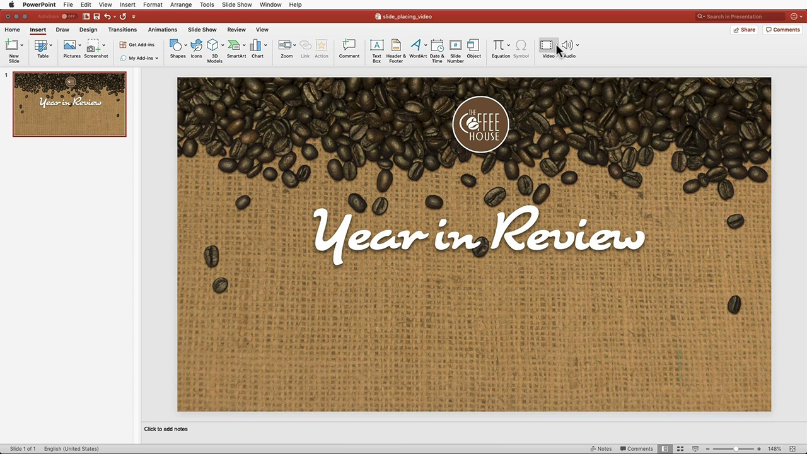

# Adobe des tutoriels [!DNL Stock]

Les créatifs sont sous pression pour fournir rapidement un contenu visuel attrayant. Adobe Stock permet aux équipes de création d’accéder à plus de 300 millions d’images, de vidéos, de fichiers audio, de modèles, d’illustrations et de ressources 3D libres de droits, directement depuis les applications de Creative Cloud qu’elles utilisent chaque jour. Bénéficiez d’un accès illimité aux ressources Adobe Stock standard avec Creative Cloud Édition Pro. Explorez les dernières collections sur stock.adobe.com. Sélectionnez une image pour afficher un tutoriel.

<table>
<tr>
   <td>
      
      

      <a href="stunning-digital-assets.md"><strong>Superbes ressources numériques (PDF)</strong></a>
      

      <em>Apprenez à intégrer Adobe Stock à CC Libraries pour obtenir des résultats de conception cohérents et professionnels pour l’impression et l’affichage dans ce tutoriel pratique</em>
       
  </td>
  <td>
      
      

      <a href="searchstock.md"><strong>Historique des licences de l'Adobe de recherche [!DNL Stock]</strong></a>
      

      <em>Découvrez comment effectuer une recherche rapide dans l'historique des licences [!DNL Stock] Adobe de votre organisation dans Creative Cloud abonnement Entreprise</em>
       
  </td>
  <td>
      
      

      <a href="handdrawn.md"><strong>Ajouter une esthétique dessinée à la main aux [!DNL Stock] images de l'Adobe</strong></a>
      

      <em>Dynamisez votre marketing créatif avec des techniques uniques qui ajoutent de la profondeur et de la dimension à vos images à l’aide de Photoshop pour iPad</em>
       
  </td>
  <td>
   
    

   <a href="flairtypography.md"><strong>Ajoutez du style à la typographie avec des masques et des animations</strong></a>
    

    <em>Donnez vie à votre texte avec des éléments de l’Adobe [!DNL Stock] et des styles d’animation d’After Effects</em>
     
  </td>
</tr>
<tr>
  <td>
      
      

      <a href="animatevector.md"><strong>Animer une illustration vectorielle Adobe [!DNL Stock] dans Photoshop</strong></a>
      

      <em>Intégrez des animations dans les graphiques de votre bulletin d'informations avec des vecteurs modifiables pour l'Adobe [!DNL Stock]</em>
       
  </td>
 <td>
      
      

      <a href="annualreport.md"><strong>Commencez votre rapport annuel avec une vidéo créée avec l’Adobe [!DNL Stock] et Spark Video</strong></a>
      

      <em>Faites de votre rapport annuel un article avec Adobe [!DNL Stock] et Spark Video</em>
       
  </td>
  <td>
      
      

      <a href="customanimations.md"><strong>Donnez vie à vos créations avec des animations personnalisées par Adobe [!DNL Stock]</strong></a>
      

      <em>Utilisez des images, des textures et des motifs Adobes [!DNL Stock] pour créer des animations personnalisées dans Photoshop</em>
       
  </td>
  <td>
      
      

      <a href="changecolors.md"><strong>Modifier les couleurs d'une image [!DNL Stock] Adobe pour qu'elles correspondent à votre story</strong></a>
      

      <em>Recherchez une photo unique dans l'Adobe [!DNL Stock], puis ajustez la couleur dans Adobe Photoshop en fonction de vos besoins</em>
       
  </td>
</tr>
<tr>
 <td>
      
      

      <a href="collage.md"><strong>Créez un collage 3D pour une affiche à l’aide d’Adobes [!DNL Stock] images</strong></a>
      

      <em>Créez un collage dans Adobe Illustrator qui présente un effet 3D accrocheur à partir d'images dans l'Adobe [!DNL Stock]</em>
       
  </td>
  <td>
      
      

      <a href="boldlabel.md"><strong>Créez une étiquette audacieuse avec des modèles Adobes [!DNL Stock] et des objets dynamiques Photoshop</strong></a>
      

      <em>Concevez et visualisez vos designs personnalisés avec des modèles d’emballage réalistes de l’Adobe [!DNL Stock]</em>
       
  </td>
  <td>
      
      

      <a href="infographic.md"><strong>Créer une infographie sur les directives de l'entreprise avec l'Adobe [!DNL Stock]</strong></a>
      

      <em>Combinez diverses ressources de l'Adobe [!DNL Stock] pour communiquer des directives sous la forme d'infographies visuellement convaincantes</em>
       
  </td>
 <td>
      
      

      <a href="featurecomparison.md"><strong>Créer un tableau comparatif des fonctionnalités du produit à l'aide de l'Adobe [!DNL Stock]</strong></a>
      

      <em>Créez un graphique qui compare les formules de tarification des produits afin de fournir aux clients potentiels les informations dont ils ont besoin en un coup d'œil</em>
       
  </td>
</tr>
<tr>
   <td>
      
      

      <a href="surrealcomposite.md"><strong>Créer une composition semi-surréaliste avec l'Adobe [!DNL Stock]</strong></a>
      

      <em>Créez une image éditoriale inoubliable en combinant plusieurs images avec des effets de couleur, de mouvement et de masquage</em>
       
  </td>
   <td>
      
      

      <a href="surrealpattern.md"><strong>Créer un motif semi-surréaliste avec l'Adobe [!DNL Stock]</strong></a>
      

      <em>Créez un magnifique motif fluide à partir d’images surréalistes de l’Adobe [!DNL Stock]</em>
       
  </td>
   <td>
      
      

      <a href="productconfigurator.md"><strong>Créez un configurateur de produit interactif avec l'Adobe [!DNL Stock]</strong></a>
      

      <em>Utilisez la puissance de l’interactivité, de l’animation et des illustrations modifiables de l’Adobe [!DNL Stock] pour présenter des informations financières de manière visuelle</em>
       
  </td>
  <td>
      
      

      <a href="interactivetourismphoto.md"><strong>Créez une photo de tourisme interactive avec l'Adobe [!DNL Stock] et la XD</strong></a>
      

      <em>Créez rapidement une photo interactive dans votre prototype de site web avec l'Adobe [!DNL Stock] et XD</em>
       
  </td>
</tr>
<tr>
 <td>
      
      

      <a href="animationemail.md"><strong>Créez des animations pour vos courriers électroniques avec l’Adobe [!DNL Stock] et Photoshop</strong></a>
      

      <em>Dynamisez vos e-mails grâce à l'animation par action rapide avec l'Adobe [!DNL Stock] et Photoshop</em>
       
  </td>
  <td>
      
      

      <a href="brandgradients.md"><strong>Créez des images de marque cohérentes avec de superbes dégradés et des [!DNL Stock] ressources Adobes</strong></a>
      

      <em>Créez une unité de marque avec différentes images en combinant des couleurs et des dégradés dans votre campagne publicitaire</em>
       
   </td>
  <td>
      
      

      <a href="webgraphics.md"><strong>Créez des graphismes web attrayants en combinant des images [!DNL Stock] Adobes avec des feuilles de style CSS</strong></a>
      

      <em>Créez une unité de marque avec différentes images en combinant des couleurs et des dégradés dans votre campagne publicitaire</em>
       
  </td>
  <td>
      
      

      <a href="moodboard.md"><strong>Créez des planches d’ambiance inspirantes en un rien de temps avec l’Adobe [!DNL Stock]</strong></a>
      

      <em>Créez une planche d’ambiance de projet pour transmettre des informations, des idées, des visuels et des palettes de couleurs aux équipes/clients</em>
       
  </td>
</tr>
<tr>
   <td>
      
      

      <a href="realisticcomposite.md"><strong>Créez des compositions photo réalistes avec des images [!DNL Stock] Adobes</strong></a>
      

      <em>Réunissez deux photos d'Adobe [!DNL Stock] pour attirer les gens dans vos publications sur les réseaux sociaux</em>
       
  </td>
   <td>
   
    

   <a href="loadingscreen.md"><strong>Personnaliser une animation d'écran de chargement avec l'Adobe [!DNL Stock] et XD</strong></a>
    

    <em>Personnalisez une illustration vectorielle de l’Adobe [!DNL Stock] pour créer une animation d’écran de chargement attrayante pour une application mobile</em>
     
  </td>
  <td>
   
    

   <a href="presentationtemplate.md"><strong>Personnalisez un modèle de présentation Adobe [!DNL Stock] pour lui donner un aspect professionnel, mais accrocheur</strong></a>
    

    <em>Créez une superbe présentation stylisée en quelques minutes avec des images et des modèles de l'Adobe [!DNL Stock] et quelques effets spéciaux faciles à appliquer</em>
     
  </td>
   <td>
   
    

   <a href="customizecolors.md"><strong>Personnalisation des couleurs dans une illustration vectorielle [!DNL Stock] Adobe</strong></a>
    

    <em>Ajoutez du vernis à n’importe quel projet avec une superbe illustration. Recherchez le vecteur idéal dans l'Adobe [!DNL Stock], puis associez les couleurs à la palette de votre projet à l'aide d'Adobe Illustrator</em>
     
  </td>
</tr>
<tr>
   <td>
      
      

      <a href="assets/AddMotiontoStillImageswithAdobeStockandPhotoshop.pdf"><strong>Ajouter du mouvement aux images fixes avec l’Adobe [!DNL Stock] et Photoshop (PDF)</strong></a>
      

      <em>Émerveillez votre public sur n'importe quel écran en incorporant une vidéo dans une image fixe</em>
       
   </td>
   <td>
   
    

   <a href="assets/CreateacompositewithPhotoshopontheiPadandAdobeStockimages.pdf" target="_blank"><strong>Créez une composition avec Photoshop dans iPad et Adobe des images [!DNL Stock] (PDF)</strong></a>
    

    <em>Apprenez à utiliser l’une de vos applications Adobe Creative Cloud préférées d’une toute nouvelle manière grâce à la puissance de Photoshop sur votre iPad</em>
     
  </td>
   <td>
   
    

   <a href="assets/CreateaUniqueEditorialGraphicwithAfterEffectsandAdobeStock.pdf" target="_blank"><strong>Animer une illustration vectorielle Adobe [!DNL Stock] dans Photoshop (PDF)</strong></a>
    

    <em>En associant After Effects à l'Adobe [!DNL Stock], vous pouvez rapidement créer de superbes effets spéciaux qui vous aident à raconter visuellement une histoire</em>
     
  </td>
   <td>
      
      

      <a href="assets/CreateUniqueGraphicsbyCombiningAdobeStockImages.pdf" target="_blank"><strong>Créez des graphiques uniques en combinant des images [!DNL Stock] Adobes (PDF)</strong></a>
      

      <em>Réunissez deux images différentes pour créer une scène entièrement nouvelle pour vos projets de conception. L'Adobe [!DNL Stock] et Adobe Photoshop facilitent les choses</em>
       
   </td>
</tr>
<tr>
  <td>
      
      

      <a href="assets/CreatingaHalloweenCinemagraphwithPhotoshopCCandAdobeStock.pdf" target="_blank"><strong>Création d’un cinémagraphe d’Halloween avec Photoshop CC et l’Adobe [!DNL Stock] (PDF)</strong></a>
      

      <em>Créez un cinémagraphe en combinant des vidéos, des illustrations et des photos avec Adobe Photoshop</em>
       
  </td>
   <td>
      
      

      <a href="assets/PutyourDatainMotionwithAdobeStockandPremierePro.pdf" target="_blank"><strong>Mettez vos données en mouvement avec l’Adobe [!DNL Stock] et le Premiere Pro (PDF)</strong></a>
      

      <em>Donnez vie à vos données pour raconter une histoire plus convaincante à l'aide d'Adobe [!DNL Stock] et d'Adobe Premiere Pro</em>
       
  </td>
   <td>
      
      

      <a href="assets/RecolorAdobeStockVectorArtworkwithAdobeIllustratortoGetExactlytheLookYouWant.pdf" target="_blank"><strong>Redéfinir les couleurs des illustrations vectorielles de l’Adobe [!DNL Stock] avec Adobe Illustrator pour obtenir exactement l’aspect souhaité (PDF)</strong></a>
      

      <em>L’Adobe [!DNL Stock] facilite la recherche d’images vectorielles uniques, et Adobe Illustrator vous permet de les modifier rapidement pour les adapter à votre vision créative</em>
       
   </td>
   <td>
      
      

      <a href="assets/ShowOffyourDesignWorkintheRealWorldwithAdobeStockandPhotoshop.pdf" target="_blank"><strong>Mettez en valeur votre travail de conception dans le monde réel avec l’Adobe [!DNL Stock] et Photoshop (PDF)</strong></a>
      

      <em>Suivez ces étapes pour présenter votre travail dans un modèle [!DNL Stock] à l'Adobe réaliste à l'aide d'Adobe Photoshop</em>
       
  </td>
 </tr> 
 <tr>
   <td>
      
      

      <a href="assets/UncoveramazingdetailsinAdobeStockimageswithLightroomformobile.pdf" target="_blank"><strong>Découvrez des détails incroyables dans les images d'Adobe [!DNL Stock] avec Lightroom for mobile (PDF)</strong></a>
      

      <em>Découvrez la puissance de Lightroom sur votre appareil mobile pour faire ressortir le meilleur de vos images</em>
       
  </td>
  <td>
      
      

      <a href="assets/VisualizePosterDesignsintheRealWorldwithAdobeStockandPhotoshop.pdf" target="_blank"><strong>Visualisez des conceptions d’affiches dans le monde réel avec Adobe [!DNL Stock] et Photoshop (PDF)</strong></a>
      

      <em>Présentez vos créations dans des environnements réels pour avoir une meilleure idée de leur apparence sur le monde</em>
       
  </td>
  <td>
    
    

     
  </td>
</tr>
</table>
