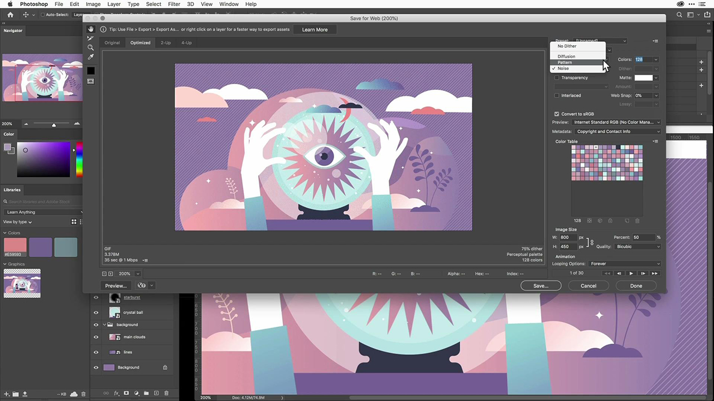

# Adobe [!DNL Stock] tutoriels

Les créatifs sont sous pression pour fournir rapidement un contenu visuel attrayant. Adobe Stock permet aux équipes de création d’accéder à plus de 300 millions d’images, de vidéos, de fichiers audio, de modèles, d’illustrations et de ressources 3D libres de droits, directement depuis les applications de Creative Cloud qu’elles utilisent chaque jour. Bénéficiez d’un accès illimité aux ressources Adobe Stock standard avec Creative Cloud Édition Pro. Explorez les dernières collections sur stock.adobe.com. Sélectionnez une image pour afficher un tutoriel.

<table>
<tr>
   <td>
      
      

      <a href="stunning-digital-assets.md"><strong>Superbes ressources numériques (PDF)</strong></a>
      

      <em>Ce tutoriel pratique vous explique comment intégrer Adobe Stock aux bibliothèques CC pour obtenir des résultats de conception cohérents et professionnels pour l’impression et l’affichage</em>
       
  </td>
  <td>
      
      

      <a href="searchstock.md"><strong>Adobe de recherche [!DNL Stock] historique des licences</strong></a>
      

      <em>Découvrez comment effectuer une recherche rapide dans l’Adobe de votre organisation [!DNL Stock] historique des licences dans Creative Cloud abonnement entreprise</em>
       
  </td>
  <td>
      
      

      <a href="handdrawn.md"><strong>Ajouter une esthétique dessinée à la main à l’Adobe [!DNL Stock] images</strong></a>
      

      <em>Renforcez votre marketing créatif avec des techniques uniques qui ajoutent de la profondeur et de la dimension à vos images à l’aide de Photoshop pour iPad</em>
       
  </td>
  <td>
   
    

   <a href="flairtypography.md"><strong>Ajoutez du style à la typographie avec des masques et des animations</strong></a>
    

    <em>Donnez vie à votre texte avec des éléments d’Adobe [!DNL Stock] et les styles d’animation d’After Effects</em>
     
  </td>
</tr>
<tr>
  <td>
      
      

      <a href="animatevector.md"><strong>Animer un Adobe [!DNL Stock] illustration vectorielle dans Photoshop</strong></a>
      

      <em>Animez vos bulletins graphiques avec des vecteurs modifiables pour l'Adobe [!DNL Stock]</em>
       
  </td>
 <td>
      
      

      <a href="annualreport.md"><strong>Commencez votre rapport annuel avec une vidéo créée avec Adobe [!DNL Stock] et Spark Video</strong></a>
      

      <em>Faites de votre rapport annuel une histoire avec Adobe [!DNL Stock] et Spark Video</em>
       
  </td>
  <td>
      
      

      <a href="customanimations.md"><strong>Donnez vie à vos créations avec des animations personnalisées par Adobe [!DNL Stock]</strong></a>
      

      <em>Utiliser l’Adobe [!DNL Stock] images, textures, motifs pour créer des animations personnalisées dans Photoshop</em>
       
  </td>
  <td>
      
      

      <a href="changecolors.md"><strong>Modifier un Adobe [!DNL Stock] couleurs de l’image pour correspondre à votre story</strong></a>
      

      <em>Trouver une photo unique en Adobe [!DNL Stock] puis ajustez la couleur dans Adobe Photoshop en fonction de vos besoins</em>
       
  </td>
</tr>
<tr>
 <td>
      
      

      <a href="collage.md"><strong>Création d’un collage 3D pour une affiche à l’aide de l’Adobe [!DNL Stock] images</strong></a>
      

      <em>Créez un collage dans Adobe Illustrator avec un effet 3D accrocheur à partir d’images prises dans Adobe [!DNL Stock]</em>
       
  </td>
  <td>
      
      

      <a href="boldlabel.md"><strong>Création d’une étiquette audacieuse avec de l’Adobe [!DNL Stock] Modèles et objets dynamiques Photoshop</strong></a>
      

      <em>Créez et visualisez vos designs personnalisés avec des templates d’emballage réalistes d’Adobe [!DNL Stock]</em>
       
  </td>
  <td>
      
      

      <a href="infographic.md"><strong>Création d'une infographie sur les lignes directrices d'une entreprise avec Adobe [!DNL Stock]</strong></a>
      

      <em>Combiner diverses ressources à partir de l’Adobe [!DNL Stock] pour communiquer des directives sous la forme d’infographies visuellement convaincantes</em>
       
  </td>
 <td>
      
      

      <a href="featurecomparison.md"><strong>Création d’un tableau comparatif des fonctionnalités d’un produit à l’aide de l’Adobe [!DNL Stock]</strong></a>
      

      <em>Créez un graphique qui compare les plans de tarification des produits pour fournir aux clients potentiels les informations dont ils ont besoin en un coup d’œil</em>
       
  </td>
</tr>
<tr>
   <td>
      
      

      <a href="surrealcomposite.md"><strong>Création d’une composition semi-surréaliste avec Adobe [!DNL Stock]</strong></a>
      

      <em>Créez une image éditoriale inoubliable en combinant plusieurs images avec des effets de couleur, de mouvement et de masquage</em>
       
  </td>
   <td>
      
      

      <a href="surrealpattern.md"><strong>Création d’un motif semi-surréaliste avec Adobe [!DNL Stock]</strong></a>
      

      <em>Créez un magnifique motif fluide basé sur des images surréalistes de l’Adobe [!DNL Stock]</em>
       
  </td>
   <td>
      
      

      <a href="productconfigurator.md"><strong>Création d’un configurateur de produit interactif avec Adobe [!DNL Stock]</strong></a>
      

      <em>Utilisez la puissance de l’interactivité, de l’animation et des illustrations modifiables depuis l’Adobe [!DNL Stock] présenter l'information financière de façon visuelle</em>
       
  </td>
  <td>
      
      

      <a href="interactivetourismphoto.md"><strong>Création d'une photo de tourisme interactive avec Adobe [!DNL Stock] et XD</strong></a>
      

      <em>Créez rapidement une photo interactive dans votre prototype de site web avec Adobe [!DNL Stock] &amp; XD</em>
       
  </td>
</tr>
<tr>
 <td>
      
      

      <a href="animationemail.md"><strong>Création d’animations pour les e-mails avec Adobe [!DNL Stock] et Photoshop</strong></a>
      

      <em>Dynamisez vos e-mails grâce à l’animation Stop-Action avec Adobe [!DNL Stock] et Photoshop</em>
       
  </td>
  <td>
      
      

      <a href="brandgradients.md"><strong>Créez des images de marque cohérentes avec de superbes dégradés et Adobes [!DNL Stock] ressources</strong></a>
      

      <em>Créez une unité de marque avec différentes images en combinant des couleurs et des dégradés dans votre campagne publicitaire</em>
       
   </td>
  <td>
      
      

      <a href="webgraphics.md"><strong>Créez des graphismes web attrayants en combinant des Adobes [!DNL Stock] images avec CSS</strong></a>
      

      <em>Créez une unité de marque avec différentes images en combinant des couleurs et des dégradés dans votre campagne publicitaire</em>
       
  </td>
  <td>
      
      

      <a href="moodboard.md"><strong>Créez des planches d’ambiance inspirantes en un rien de temps avec Adobe [!DNL Stock]</strong></a>
      

      <em>Créez une planche d’ambiance de projet pour transmettre des informations, des idées, des visuels et des palettes de couleurs aux équipes/clients.</em>
       
  </td>
</tr>
<tr>
   <td>
      
      

      <a href="realisticcomposite.md"><strong>Créez des compositions photo réalistes avec de l’Adobe [!DNL Stock] images</strong></a>
      

      <em>Réunissez deux grands Adobes [!DNL Stock] photos pour attirer des personnes dans vos publications sur les réseaux sociaux</em>
       
  </td>
   <td>
   
    

   <a href="loadingscreen.md"><strong>Personnalisation d’une animation d’écran de chargement avec l’Adobe [!DNL Stock] et XD</strong></a>
    

    <em>Personnalisation d’illustrations vectorielles depuis l’Adobe [!DNL Stock] pour créer une animation d’écran de chargement glaçante pour une application mobile :</em>
     
  </td>
  <td>
   
    

   <a href="presentationtemplate.md"><strong>Personnaliser un Adobe [!DNL Stock] modèle de présentation à la fois professionnel et accrocheur</strong></a>
    

    <em>Créez une superbe présentation stylisée en quelques minutes avec des images et des templates provenant d’Adobes [!DNL Stock] et quelques effets spéciaux faciles à appliquer</em>
     
  </td>
   <td>
   
    

   <a href="customizecolors.md"><strong>Personnalisation des couleurs d’un Adobe [!DNL Stock] illustration vectorielle</strong></a>
    

    <em>Ajoutez du vernis à n’importe quel projet avec une superbe illustration. Trouvez le vecteur idéal dans Adobe [!DNL Stock], puis faites correspondre les couleurs à la palette de votre projet à l’aide d’Adobe Illustrator</em>
     
  </td>
</tr>
<tr>
   <td>
      
      

      <a href="assets/AddMotiontoStillImageswithAdobeStockandPhotoshop.pdf"><strong>Animation d’images fixes avec Adobe [!DNL Stock] et Photoshop (PDF)</strong></a>
      

      <em>Impressionnez votre public sur n’importe quel écran en incorporant de la vidéo dans une image fixe</em>
       
   </td>
   <td>
   
    

   <a href="assets/CreateacompositewithPhotoshopontheiPadandAdobeStockimages.pdf" target="_blank"><strong>Création d’une image composite avec Photoshop sur iPad et Adobe [!DNL Stock] images (PDF)</strong></a>
    

    <em>Apprenez à utiliser l’une de vos applications Adobe Creative Cloud préférées d’une toute nouvelle manière grâce à la puissance de Photoshop sur votre iPad</em>
     
  </td>
   <td>
   
    

   <a href="assets/CreateaUniqueEditorialGraphicwithAfterEffectsandAdobeStock.pdf" target="_blank"><strong>Animer un Adobe [!DNL Stock] illustration vectorielle dans Photoshop (PDF)</strong></a>
    

    <em>En associant After Effects à Adobe [!DNL Stock], vous pouvez créer rapidement de superbes effets spéciaux qui vous aident à raconter visuellement une histoire</em>
     
  </td>
   <td>
      
      

      <a href="assets/CreateUniqueGraphicsbyCombiningAdobeStockImages.pdf" target="_blank"><strong>Créez des graphismes uniques en combinant des Adobes [!DNL Stock] images (PDF)</strong></a>
      

      <em>Rassemblez deux images différentes pour créer une scène entièrement nouvelle pour vos projets de conception. Adobe [!DNL Stock] et Adobe Photoshop vous facilite la tâche</em>
       
   </td>
</tr>
<tr>
  <td>
      
      

      <a href="assets/CreatingaHalloweenCinemagraphwithPhotoshopCCandAdobeStock.pdf" target="_blank"><strong>Création d’un cinémagraphe d’Halloween avec Photoshop CC et Adobe [!DNL Stock] (PDF)</strong></a>
      

      <em>Création d’un cinémagraphe en utilisant Adobe Photoshop pour composer des vidéos, des illustrations et des photos</em>
       
  </td>
   <td>
      
      

      <a href="assets/PutyourDatainMotionwithAdobeStockandPremierePro.pdf" target="_blank"><strong>Mettez vos données en mouvement avec Adobe [!DNL Stock] et Premiere Pro (PDF)</strong></a>
      

      <em>Donnez vie à vos données pour raconter une histoire plus convaincante en utilisant l'Adobe [!DNL Stock] et Adobe Premiere Pro</em>
       
  </td>
   <td>
      
      

      <a href="assets/RecolorAdobeStockVectorArtworkwithAdobeIllustratortoGetExactlytheLookYouWant.pdf" target="_blank"><strong>Adobe de redéfinition des couleurs [!DNL Stock] illustrations vectorielles avec Adobe Illustrator pour obtenir exactement le look que vous voulez (PDF)</strong></a>
      

      <em>Adobe [!DNL Stock] facilite la recherche d’images vectorielles uniques et Adobe Illustrator vous permet de les modifier rapidement pour les adapter à votre vision créative</em>
       
   </td>
   <td>
      
      

      <a href="assets/ShowOffyourDesignWorkintheRealWorldwithAdobeStockandPhotoshop.pdf" target="_blank"><strong>Mettez votre travail de conception en valeur dans le monde réel avec Adobe [!DNL Stock] et Photoshop (PDF)</strong></a>
      

      <em>Procédez comme suit pour présenter votre travail dans un Adobe réaliste [!DNL Stock] modèle utilisant Adobe Photoshop</em>
       
  </td>
 </tr> 
 <tr>
   <td>
      
      

      <a href="assets/UncoveramazingdetailsinAdobeStockimageswithLightroomformobile.pdf" target="_blank"><strong>Découvrez des détails incroyables dans l’Adobe [!DNL Stock] images avec Lightroom for mobile (PDF)</strong></a>
      

      <em>Découvrez la puissance de Lightroom sur votre appareil mobile pour faire ressortir le meilleur de vos images</em>
       
  </td>
  <td>
      
      

      <a href="assets/VisualizePosterDesignsintheRealWorldwithAdobeStockandPhotoshop.pdf" target="_blank"><strong>Visualisez les conceptions d’affiches dans le monde réel avec Adobe [!DNL Stock] et Photoshop (PDF)</strong></a>
      

      <em>Présentez vos créations dans des environnements réels pour avoir une meilleure idée de la façon dont elles apparaissent dans le monde</em>
       
  </td>
  <td>
    
    

     
  </td>
</tr>
</table>
