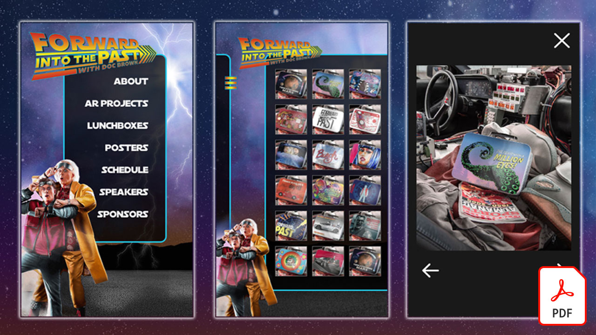
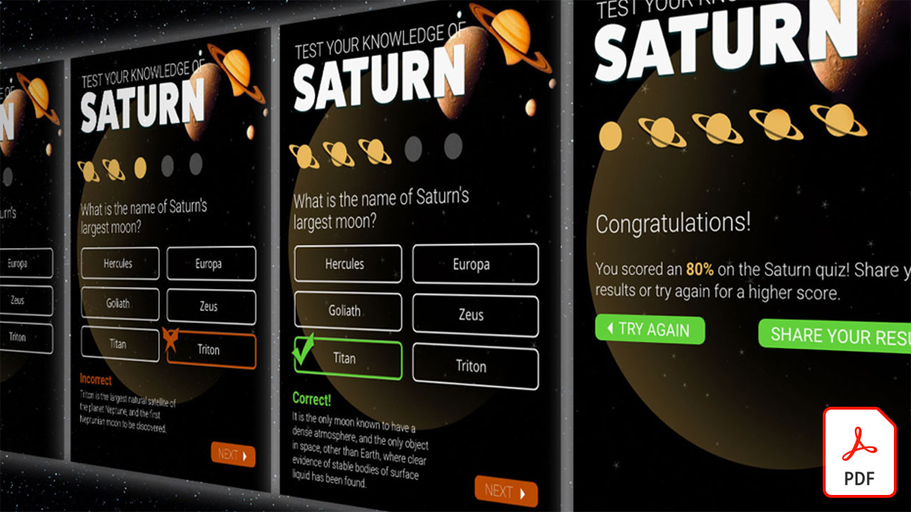

# Tutoriels Adobe XD

Adobe XD est un outil de design et de prototypage d&#39;expérience utilisateur qui permet de concevoir des sites web, des applications, des interfaces vocales, des jeux et d&#39;autres types d&#39;expériences numériques. Sélectionnez une image pour voir un tutoriel.

<table>
<tr>
 <td>
   
    

   <a href="components.md"><strong>Familiarisez-vous avec [ ! UICONTROL Components] dans Adobe XD</strong></a>
    

    <em>Apprenez à utiliser les [ ! UICONTROL Components] pour vous offrir une flexibilité sans précédent pour appliquer la vitesse et la cohérence à votre flux de conception</em>
     
  </td>
  <td>
   
    

   <a href="assets/ControlMultipleXDArtboardswithNestedSymbols.pdf" target="_blank"><strong>Contrôle de plusieurs plans de travail XD avec des symboles imbriqués (PDF)</strong></a>
    

    <em>Les symboles constituent un excellent moyen de créer des illustrations et du texte réutilisables qui peuvent être appliqués plusieurs fois sur plusieurs plans de travail dans votre projet</em>
     
  </td>
  <td>
   
    

   <a href="assets/CreateaZoomableeCommercePhotowithXDandAdobeStock.pdf" target="_blank"><strong>Création d'une photo e-commerce zoom avec XD et Adobe [!DNL Stock] (PDF)</strong></a>
    

    <em>L’association de photos haute résolution et de la fonction d’animation automatique d’Adobe XD vous permet de créer des expériences plus attrayantes pour votre site web</em>
     
  </td>
  <td>
   
    

   <a href="assets/CreatingaRotatingProductInterfaceforECommercewithAdobeXD.pdf" target="_blank"><strong>Création d'une interface produit tournante pour le commerce électronique avec Adobe XD (PDF)</strong></a>
    

    <em>Créez une interface offrant une vue rotative de votre produit, puis vous pouvez transformer votre conception en prototype interactif qui montre exactement comment l’expérience fonctionnera sur le web ou sur mobile</em>
     
  </td>
</tr>
<tr>
  <td>
   
    

   <a href="assets/DesignandPrototypeanInteractiveQuizwithXD.pdf" target="_blank"><strong>Concevoir et prototyper un quiz interactif avec XD (PDF)</strong></a>
    

    <em>Concevez les commentaires qu’un utilisateur recevra pendant un projet</em>
     
  </td>
  <td>
   
    

   <a href="assets/DesignInteractiveProjectswithMicroAnimationsinXD.pdf" target="_blank"><strong>Concevoir des projets interactifs avec des micro-animations dans XD (PDF)</strong></a>
    

    <em>Apprenez à créer des prototypes animés interactifs de vos designs avec Adobe XD</em>
     
  </td>
  <td>
   
    

   <a href="assets/JumpstartyourXDProjectfromaPhotoshopFile.pdf" target="_blank"><strong>Démarrage rapide d’un projet XD à partir d’un fichier Photoshop (PSD) (PDF)</strong></a>
    

    <em>Adobe XD offre de remarquables outils de design interactif qui s’intègrent parfaitement à votre workflow existant, ce qui vous permet de donner une nouvelle dimension à votre vision de design interactif</em>
     
  </td>
</tr>
<tr>
  <td>
   
    

   <a href="assets/MobileWebExperienceswithXD.pdf" target="_blank"><strong>Création d'une expérience web mobile avec XD (PDF)</strong></a>
    

    <em>Découvrez les coulisses du processus de création de la galerie web mobile Russell Brown MAX Madness à l’aide d’Adobe XD</em>
     
  </td>
  <td>
   
    

   <a href="assets/PrototypeaMobileWebExperiencewithAdobeXD.pdf" target="_blank"><strong>Prototypage d’une expérience web mobile avec Adobe XD (PDF)</strong></a>
    

    <em>Le design d’expériences exige une stratégie, un design et un prototypage fonctionnel, et Adobe XD vous donne les moyens d’y parvenir</em>
     
  </td>
  <td>
   
    

   <a href="assets/PrototypeaMobileWebExperiencewithAdobeXD.pdf" target="_blank"><strong>Recharger la grille de répétition dans XD avec du texte externe et des graphiques (PDF)</strong></a>
    

    <em>Combinez la grille de répétition avec du texte et des graphiques externes pour booster votre productivité</em>
     
  </td>
  <td>
   
    

   <a href="assets/BehindtheScenesofMAXMadnesswithAdobeXD.pdf" target="_blank"><strong>Dans les coulisses de la folie MAX avec Adobe XD (PDF)</strong></a>
    

    <em>Le déploiement d'une expérience web mobile optimisée peut véritablement interpeller vos utilisateurs</em>
     
  </td>
</tr>
</table>
