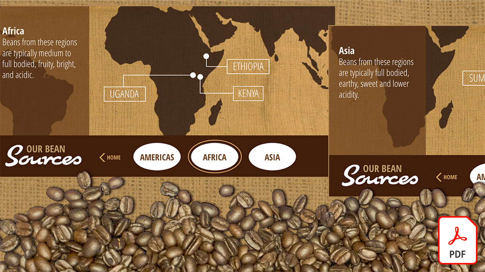

# Tutoriels Adobe XD

Adobe XD est un outil de conception et de prototypage d’expérience utilisateur permettant de concevoir des sites web, des applications, des interfaces vocales, des jeux et d’autres types d’expériences numériques. Sélectionnez une image pour afficher un tutoriel.

<table>
<tr>
 <td>
   
    

   <a href="components.md"><strong>Familiarisez-vous avec les composants [!UICONTROL] dans Adobe XD</strong></a>
    

    <em>Découvrez comment utiliser les composants [!UICONTROL] pour bénéficier d'une flexibilité sans précédent afin d'appliquer vitesse et cohérence à votre workflow de conception</em>
     
  </td>
  <td>
   
    

   <a href="assets/ControlMultipleXDArtboardswithNestedSymbols.pdf" target="_blank"><strong>Contrôler plusieurs plans de travail XD avec des symboles imbriqués (en PDF)</strong></a>
    

    <em>Les symboles constituent un excellent moyen de créer des illustrations et du texte réutilisables qui peuvent être appliqués plusieurs fois entre les plans de travail de votre projet</em>
     
  </td>
  <td>
   
    

   <a href="assets/CreateaZoomableeCommercePhotowithXDandAdobeStock.pdf" target="_blank"><strong>Créez une photo de commerce électronique zoomable avec XD et Adobe [!DNL Stock] (PDF)</strong></a>
    

    <em>L’association de la photographie haute résolution à la fonctionnalité d’animation automatique d’Adobe XD vous permet de concevoir des expériences plus attrayantes pour votre site web</em>
     
  </td>
  <td>
   
    

   <a href="assets/CreatingaRotatingProductInterfaceforECommercewithAdobeXD.pdf" target="_blank"><strong>Création d’une interface produit tournante pour E-Commerce avec Adobe XD (PDF)</strong></a>
    

    <em>Concevez une interface qui offre une vue tournante de votre produit, puis vous pouvez transformer votre conception en un prototype interactif qui montre exactement comment l'expérience fonctionnera sur le web ou sur mobile</em>
     
  </td>
</tr>
<tr>
  <td>
   
    

   <a href="assets/DesignandPrototypeanInteractiveQuizwithXD.pdf" target="_blank"><strong>Concevez et prototypez un quiz interactif avec XD (PDF)</strong></a>
    

    <em>Concevez les commentaires qu'un utilisateur rencontrera pendant un projet</em>
     
  </td>
  <td>
   
    

   <a href="assets/DesignInteractiveProjectswithMicroAnimationsinXD.pdf" target="_blank"><strong>Concevoir des projets interactifs avec des micro-animations dans XD (PDF)</strong></a>
    

    <em>Apprenez à créer des prototypes animés interactifs à l’aide d’Adobe XD</em>
     
  </td>
  <td>
   
    

   <a href="assets/JumpstartyourXDProjectfromaPhotoshopFile.pdf" target="_blank"><strong>Démarrez votre projet XD à partir d’un fichier Photoshop (PSD) (PDF)</strong></a>
    

    <em>Adobe XD propose des outils de conception interactifs étonnants qui fonctionnent en conjonction avec votre workflow existant, vous permettant de faire passer votre vision de la conception interactive au niveau supérieur</em>
     
  </td>
  <td>
   
    

   <a href="assets/MobileWebExperienceswithXD.pdf" target="_blank"><strong>Conception d’une expérience web mobile avec XD (PDF)</strong></a>
    

    <em>Découvrez les coulisses du processus de conception de la galerie web mobile Russell Brown MAX Madness à l’aide d’Adobe XD</em>
     
  </td>
</tr>
<tr>
  <td>
   
    

   <a href="assets/PrototypeaMobileWebExperiencewithAdobeXD.pdf" target="_blank"><strong>Créez un prototype d'expérience web mobile avec Adobe XD (PDF)</strong></a>
    

    <em>L’expérience de la conception nécessite de la stratégie, de la conception et un prototypage fonctionnel, et Adobe XD vous donne le pouvoir de tout faire</em>
     
  </td>
  <td>
   
    

   <a href="assets/PrototypeaMobileWebExperiencewithAdobeXD.pdf" target="_blank"><strong>Dynamisez la grille de répétition dans XD avec du texte et des graphiques externes (PDF)</strong></a>
    

    <em>Combinez la grille de répétition avec du texte et des graphiques externes pour augmenter votre productivité</em>
     
  </td>
  <td>
   
    

   <a href="assets/BehindtheScenesofMAXMadnesswithAdobeXD.pdf" target="_blank"><strong>Les coulisses de la folie MAX avec Adobe XD (PDF)</strong></a>
    

    <em>Offrir une expérience web mobile optimisée peut vraiment trouver un écho auprès de vos utilisateurs</em>
     
  </td>
  <td>
    
    

     
  </td>
</tr>
</table>
